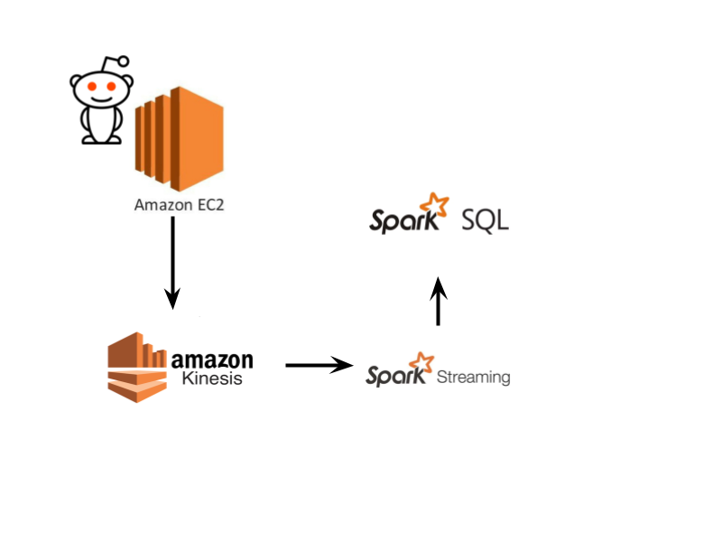

# Distributed Real-Time Sentiment Analysis Data Pipeline
A big data pipeline that creates a continuous steam of news article submissions via the Reddit API on an AWS EC2 instance. The data pulled is then sent to an AWS Kinesis Stream to be read and digested in a scalable manner. The Kinesis stream is then integrated with Apache Spark Structured Streaming, and analyzed using Apache Spark SQL.

## Architecture
The Architectural structure for the data pipeline is shown below:

## Built With
* Reddit API
* AWS EC2
* AWS Kinesis Streams
* Apache Spark Structured Streaming
* Apache Spark SQL

## Sources and Acknowledgements

[Apache Spark and AWS Kinesis Streaming Integration Documentation](https://spark.apache.org/docs/2.2.0/streaming-kinesis-integration.html)
[Apache Spark Structured Streaming Guide](https://spark.apache.org/docs/latest/structured-streaming-programming-guide.html#quick-example)
[Optimization of Spark to process Kinesis Streams](https://aws.amazon.com/blogs/big-data/optimize-spark-streaming-to-efficiently-process-amazon-kinesis-streams/)
[Real-time discovery platform with AWS](https://aws.amazon.com/blogs/big-data/building-a-near-real-time-discovery-platform-with-aws/)
[DataBricks Clusters & Management](https://docs.databricks.com/clusters/index.html)

